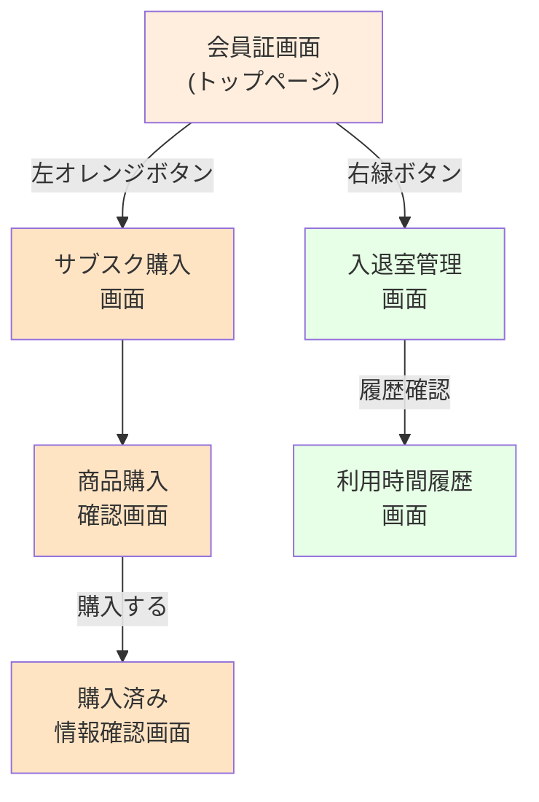
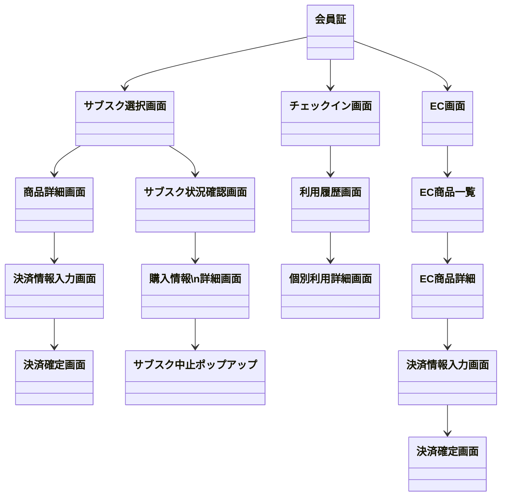

```mermaid 
flowchart TB
    TopPage["会員証画面\n(トップページ)"]
    SubsPurchase["サブスク購入\n画面"]
    PurchaseConfirm["商品購入\n確認画面"]
    PurchaseComplete["購入済み\n情報確認画面"]
    AccessManage["入退室管理\n画面"]
    AccessHistory["利用時間履歴\n画面"]

    TopPage -->|左オレンジボタン| SubsPurchase
    TopPage -->|右緑ボタン| AccessManage
    SubsPurchase --> PurchaseConfirm
    PurchaseConfirm -->|購入する| PurchaseComplete
    AccessManage -->|履歴確認| AccessHistory

    style TopPage fill:#ffeedd
    style SubsPurchase fill:#ffe4c4
    style PurchaseConfirm fill:#ffe4c4
    style PurchaseComplete fill:#ffe4c4
    style AccessManage fill:#e6ffe6
    style AccessHistory fill:#e6ffe6

```

  

```mermaid

  

classDiagram
	direction TB
	class `会員証` {
	
	}
	
	class `サブスク選択画面` {
	
	}
	
	class `商品詳細画面` {
	
	}
	
	class `決済情報入力画面` {
	
	}
	
	class `決済確定画面` {
	
	}
	
	class `サブスク状況確認画面` {
	
	}
	
	class `購入情報\n詳細画面` {
	
	}
	
	class `サブスク中止ポップアップ` {
	
	}
	
	class `チェックイン画面` {
	
	}
	
	class `利用履歴画面` {
	
	}
	
	class `個別利用詳細画面` {
	
	}
	
	class `EC画面` {
	
	}
	
	class `EC商品一覧` {
	
	}
	
	class `EC商品詳細` {
	
	}
	
	class `決済情報入力画面_1`["決済情報入力画面"] {
	
	}
	
	class `決済確定画面_1`["決済確定画面"] {
	
	}
	
	`会員証` --> `サブスク選択画面`
	
	`サブスク選択画面` --> `商品詳細画面`
	
	`商品詳細画面` --> `決済情報入力画面`
	
	`決済情報入力画面` --> `決済確定画面`
	
	`サブスク選択画面` --> `サブスク状況確認画面`
	
	`サブスク状況確認画面` --> `購入情報\n詳細画面`
	
	`購入情報\n詳細画面` --> `サブスク中止ポップアップ`
	
	`会員証` --> `チェックイン画面`
	
	`チェックイン画面` --> `利用履歴画面`
	
	`利用履歴画面` --> `個別利用詳細画面`
	
	`会員証` --> `EC画面`
	
	`EC画面` --> `EC商品一覧`
	
	`EC商品一覧` --> `EC商品詳細`
	
	`EC商品詳細` --> `決済情報入力画面_1`
	
	`決済情報入力画面_1` --> `決済確定画面_1`
	
	  

```
